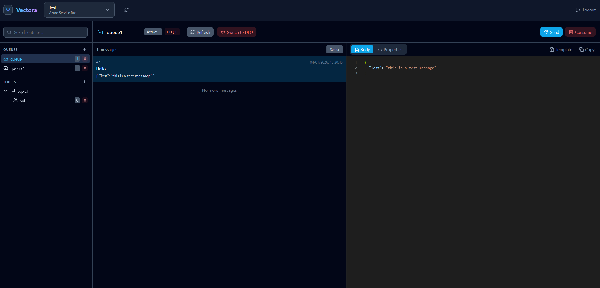

# Vectora

A modern, self-hosted Azure Service Bus explorer — a lightweight alternative to Service Bus Explorer.



## Features

- 🧪 **Fully supports Azure Service Bus Emulator**
- 🔍 Browse queues, topics, and subscriptions
- 📨 Send and receive messages
- 🔐 Secure connection management with encrypted storage
- 🎨 Modern web interface with Monaco editor for message editing
- 🐳 Easy deployment with Docker

## Tech Stack

- **Backend:** .NET 10, Minimal API
- **Frontend:** React 18, TypeScript, Tailwind CSS, Vite
- **Editor:** Monaco Editor

## Quick Start

### Using Docker Compose (Recommended)

1. Create a `docker-compose.yml` file:

   ```yaml
   services:
     vectora:
       image: jugand/vectora:latest
       restart: unless-stopped
       ports:
         - "8080:8080"
       volumes:
         - vectora-data:/data
       environment:
         - VECTORA_PASSWORD=your-secure-password

   volumes:
     vectora-data:
   ```

2. Start the application:
   ```bash
   docker compose up -d
   ```

3. Open your browser and navigate to [http://localhost:8080](http://localhost:8080)

### Configuration

| Environment Variable | Description
|---------------------|-------------|
| `VECTORA_PASSWORD` | [Optional] Password for authentication

## Navigating the application
The application remembers your connections, so you don't have to specify them everytime, as long as you have a persistant volume (for SQLite).  
When you open up the application for the first time, if you have specified a password, you'll be greeted with the login screen, otherwise, sent directly to the explorer UI.  

### First time setup
You need to set up at least one Service Bus connection, in order for the explorer interface to show up.  
1. Navigate the dropdown at the top menu
2. Press **Manage Connections**
3. Press **Add Connection**
4. Fill in **Connection Name** and **Connection String**
5. [Optional] If you wish to set up Service Bus emulator connection, make sure to check the **This is an emulator connection** and provide the JSON configuration file of the emulator, as per the Microsoft documentation
6. Press **Save**
7. You can now select the connection from the dropdown and see its entities

For the emulator connections, you can place the default connection string, specified by Microsoft [in the documentation](https://learn.microsoft.com/en-us/azure/service-bus-messaging/test-locally-with-service-bus-emulator)  

```
Endpoint=sb://<your service bus emulator container>;SharedAccessKeyName=RootManageSharedAccessKey;SharedAccessKey=SAS_KEY_VALUE;UseDevelopmentEmulator=true;
```

The purpose of requesting connection string for the emulator, is that you can choose to have a shared emulator, inside a virtual private network. In that case, the endpoint will be different.

## Development

### Prerequisites

- [.NET 10 SDK](https://dotnet.microsoft.com/download)
- [Node.js 20+](https://nodejs.org/)

### Backend

```bash
cd src/Vectora.Api
dotnet run
```

### Frontend
Make sure to copy and rename the `/Vectora.Client/.env.example` file to `.env.local` and adjust the `VITE_API_URL` value to your backend instance address.

```bash
cd src/Vectora.Client
npm install
npm run dev
```
